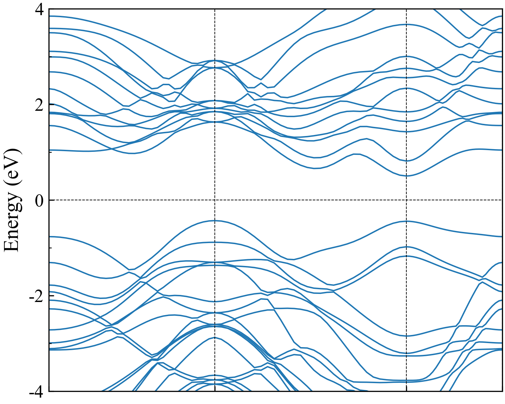

## pyband

When no argument is given, `pyband` reads in `OUTCAR` (optionally `KPOINTS`)
and find the band information within. It then plots the resulting band structure
and save it as `band.png`.

```$ pyband```



The default output image name  can be changed by adding `-o
YourImageName.suffix` to the above command line.  Note that the image format is
automatically recognized by the script, which can be any format that is
supported by `matplotlib`. The size of the image can also be speified by `-s
width height` command line arguments. 

The labels of the high-symmetry K-points, which are not shown in the figure, can
be designate by `-k` flag.

```$ pyband -k mgkm```


In some cases, if you are interested in finding out the characters of each KS
states, e.g. the contribution of some atom to each KS state, the flag `--occ
atoms` comes to help.

```$ pyband --occ '1 3 4'```


where `1 3 4` are the atom index starting from 1 to #atoms  in the above image.
The size of red dots in the figure indicates the weight of the specified atoms
to the KS states.  This can also be represented using a colormap:

```$ pyband --occ '1 3 4' --occL```


The spd-projected weight can also be specefied:

```$ pyband --occ '1 3 4' --spd '4 5 6 7 8' ```


where in the arguments of `--spd`:


> s orbital: 0

> py, pz, px orbital: 1 2 3

> dxy, dyz, dz2, dxz, dx2 orbital: 4 5 6 7 8

More command line arguments can be found by `pyband -h`.
